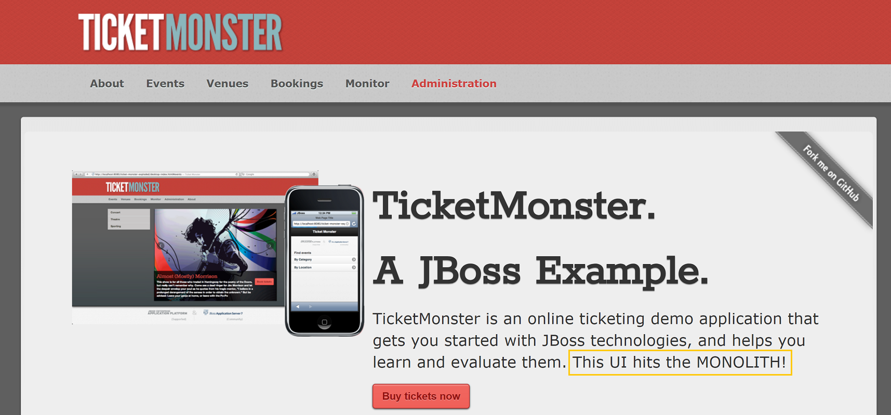

# Extract the User Interface from the Monolith

To start breaking up the monolith, a best practice is extracting the user interface from TicketMonster since this helps to decouple the client facing part from the business logic. So, this lab launches the first microservice to seperate the user interface from the rest of TicketMonster as depicted below.


## Step 1: Define a new Route to the Monolith

1. Create another route for TicketMonster monolith under the name `backend`.
    ```
    oc expose service ticketmonster-monolith --name=backend
    ``` 

1. Copy HOST/PORT of backend to clipboard.
    ```
    oc get routes 
    ```

## Step 2: Decouple the UI from the Monolith

1. (optional) Switch to the `tm-ui-v1` directory.

1. (optional) Familiarize with configuration of **Proxy** and **ReverseProxy** in `tm-ui-v1/httpd.conf`.
    ```
    ProxyPass "/rest" "http://${BACKENDURL}/rest"
    ProxyPassReverse "/rest" "http://${BACKENDURL}/rest"
    ```
    
1. Deploy the user interface. Paste your backend-url in the following format, e.g., `backend-ticketmonster.XX.XX.XX.XX.nip.io`
    ```
    oc new-app -e BACKENDURL=<your-backend-url> --docker-image=dynatraceacm/ticketmonster-ui-v1:latest
    ```

1. Expose the user interface service.
    ```
    oc expose service ticketmonster-ui-v1
    ```

## Step 3: Test UI that hits the Monolith

1. Get the public endpoint of the user interface **ticketmonster-ui-v1**.
    ```
    oc get routes
    ```

1. Open the route using a browser. Can you read **This UI hits the Monolith** on the start page? Perfect, you are now using TicketMonster via the decoupled user interface.


