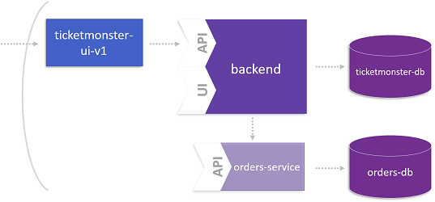

# The Microservice and its Domain Model

This lab is dedicated to the data management of the microservice we identified in the previous step. The overall goal is that the microservice consumes legacy data from the monolith but persists new data in its own database.

For more details about this lab, please take a look at the following blog post: [Identifying its Domain Model](https://www.dynatrace.com/news/blog/monolith-to-microservices-the-microservice-and-its-domain-model/).



## Step 1: Use Dynatrace to learn more about the Domain Model

1. Open Dynatrace 


## Step 2: Create Database for Microservice

1. Create the database for the microservice
    ```
    oc new-app --name=orders-db -e MYSQL_USER=ticket -e MYSQL_PASSWORD=monster -e MYSQL_DATABASE=orders mysql:5.5
    ```

## Step 3: Setup Database

1. Switch to the `orders-service/` directory.

1. Get the IP of the Pod containing the DB
    ```
    oc get pods
    ```

1. Copy initalization scripts into Pod
    ```
    oc rsync src/main/resources/db/migration/ <your-db-pod>:/var/lib/mysql --no-perms=true
    ```

1. Connect to the DB Pod and execute SQL scripts
    ```
    oc rsh <your-db-pod>
    cd ~
    cd migration
    mysql -u root orders < V1__0_ordersdb-schema.sql
    mysql -u root orders < V1__1_ordersdb-data.sql
    exit
    exit
    ```

1. (optional) Check database `orders` in your pod.
    ```
    oc rsh <your-db-pod>
    cd ~
    mysql -u root
    use orders;
    show tables;
    select * from id_generator;
    exit
    exit
    ```

1. Now, the database is prepared to store orders.