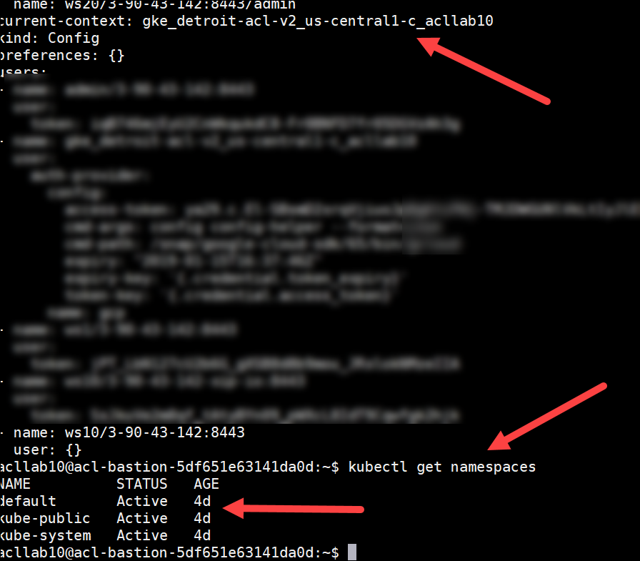

# Check Prerequisites

## Data needed
* Credentials for bastion host

## Steps

1. If you haven't received your user credentials and connection information for the bastion host, please reach out to one of the instructors.

1. Please sign up for an Ansible license if you haven't already: https://www.ansible.com/license

1. Use your ssh client to connect to the bastion host and ensure the ```kubectl``` is configured for your GKE cluster.

    ```
    (local)$ ssh <username>@<bastion-ip>
    ```

    When asked, please provide the password and you should be connected to a terminal at the bastion host.

1. Check the `kubectl` configuration
    ```
    (bastion)$ kubectl config view
    ```

    The output should look similiar to the following image, where (1) should be the name of your cluster, and (2) is the generated access token.

    

    Also, be sure the current context is set to the gcloud cluster. It should look as follows.

    

    If not, execute the following for your cluster:

    ```
    kubectl config use-context <your-gke-cluster-name>
    ```

    ```
    (bastion)$ kubectl get namespaces
    ```
    The output should look similiar to the following image.

    

---

:arrow_forward: [Next Step: Fork GitHub Repositories](../2_Fork_GitHub_Repositories)

:arrow_up_small: [Back to overview](../)
