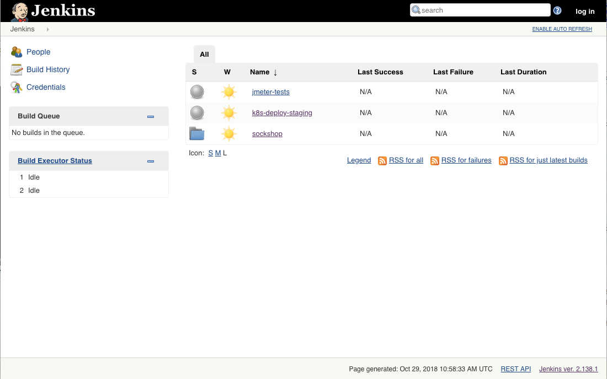
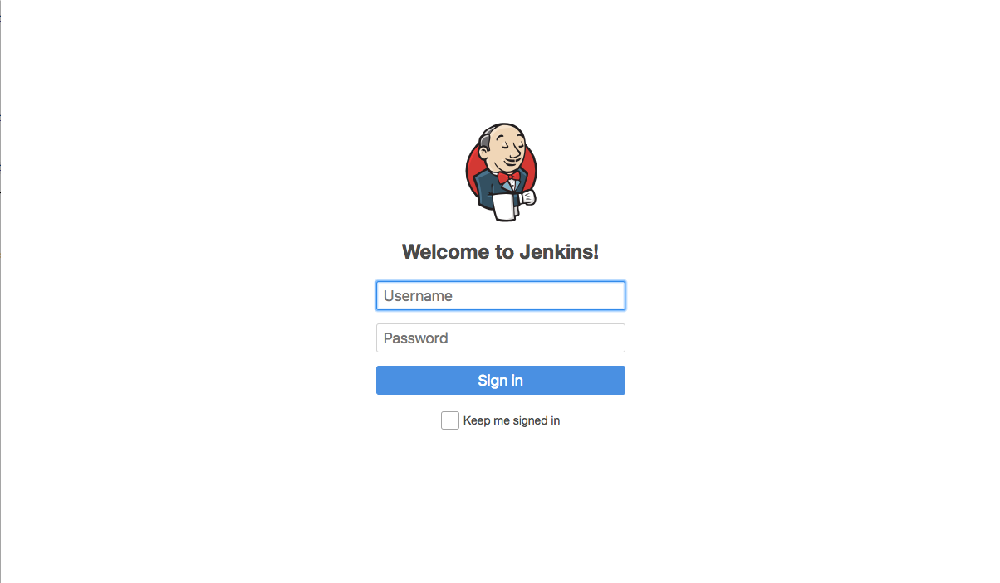
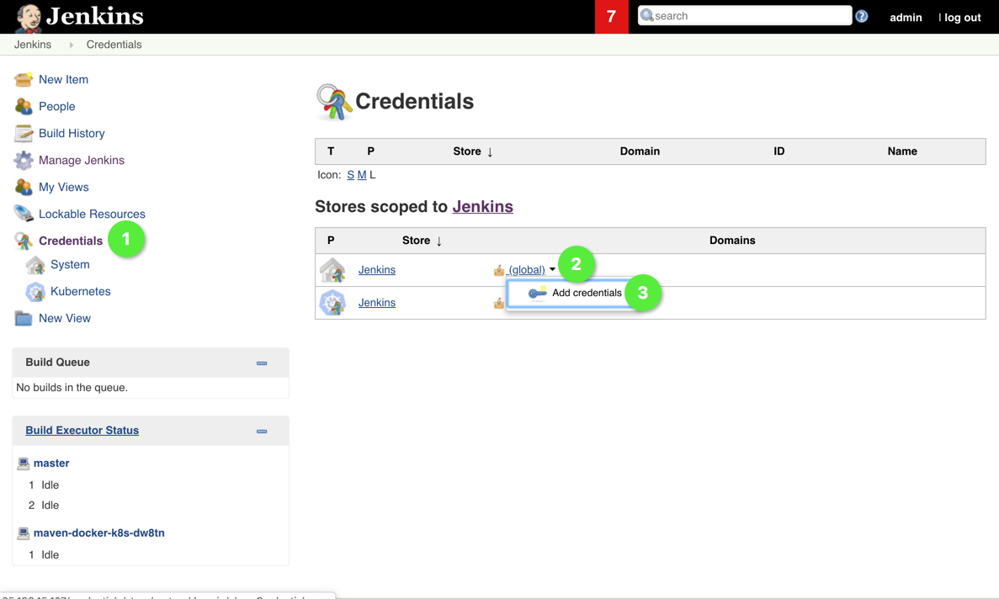

# Deploy Jenkins

Jenkins will be the CI/CD pipeline tool of choice for this workshop. We'll deploy Jenkins as a Kubernetes service and use persistent volumes for the workspace and jobs directory, so that these data is persisted, if the pod is restarted. Jenkins will subsequentially start a pod for each build that is triggered. To save bandwidth, we create one more persistent volume that acts as a maven cache volume and is mounted automatically in each pod that runs a maven build.

## Data needed
* GitHub organization
* GitHub user email address
* Docker Registry IP address (from previous step)

## Steps
1. Jenkins will be the CI/CD pipeline tool of choice for this workshop. We'll deploy Jenkins as a Kubernetes service and use persistent volumes for the workspace and jobs directory, so that these data is persisted, if the pod is restarted. Jenkins will subsequentially start a pod for each build that is triggered. To save bandwidth, we create one more persistent volume that acts as a maven cache volume and is mounted automatically in each pod that runs a maven build.

1. Create Jenkins PVCs

    ```
    (bastion)$ kubectl create -f manifests/k8s-jenkins-pvcs.yml
    ```

    Expected output:

    

1. Update the following values in the `manifests/k8s-jenkins-deployment.yml` with your GitHub orginzation, the email address of your GitHub user, and the IP address of the Docker registry we've deployed in the previous step.

    

    After updating the file, it should look something like this.

    

1. Create the Jenkins service and deployment

    ```
    (bastion)$ kubectl create -f manifests/k8s-jenkins-deployment.yml
    ```

    Expected output:

    

1. Ensure Jenkins service is deployed and get `EXTERNAL-IP` of Jenkins

    ```
    (bastion)$ kubectl -n cicd get services
    ```
 
    

1. Open `EXTERNAL-IP` in your browser and see the Jenkins UI with the preconfigured build pipelines for the Sockshop projects.

    

1. Login to Jenkins using the "log in" link in the upper right corner of the Jenkins UI with the credentials *admin*/*admin*

    

1. For later use we configure Git credentials in Jenkins, so that selected pipelines can commit commit to Git with the provided credentials. Click "Credentials" :one: in the Jenkins UI, then the small black arrow next to "global", that shows when you put the mouse cursor over "global" :two:. Finally, click "Add credentials :three:.

    

1. Provide your Git username :one:, your password :two:, and the ID :three:

    ```
    git-acm-credentials
    ```
    
    It's important to use this ID, as the credentials are referenced by this ID by selected builds. To save the credentials click OK :four:.

    

1. This concludes the setup and the configuration of Jenkins.

---

[Previous Step: Deploy Docker Registry](../3_Deploy_Docker_Registry) :arrow_backward: :arrow_forward: [Next Step: Trigger Build Pipeline](../5_Trigger_Build_Pipelines)

:arrow_up_small: [Back to overview](../)