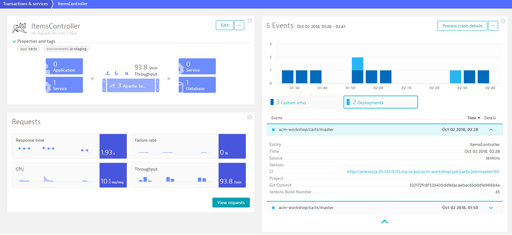

# Push Deployment & Configuration Change Events to Dynatrace

Passing meta-data is one way to enrich the meta-data in Smartscape and the automated PG, PGI and, Service detection/tagging. Additionally to meta data, you can also push deployment and configuration changes events to these Dynatrace entities. The Dynatrace Event API provides a way to either push a *Custom Annotation* or a *Custom Deployment Event* to a list of entities or entities that match certain tags. More on the [Dynatrace Event API can be found here](https://www.dynatrace.com/support/help/dynatrace-api/events/how-do-i-push-events-from-3rd-party-systems/).

In this lab you'll learn how to push deployment and configuration events to Dynatrace using the **Performance Signature Plugin** in Jenkins.

## Step 1: Performance Signature: Dynatrace in Jenkins
Before using the Performance Signature Plugin in build pipelines, it is necessary to configure it in Jenkins.
1. Go to **Jenkins** and click on **Manage Jenkins**.
1. Click on **System configuration** and scroll down to **Performance Signature: Dynatrace**.
1. **Add Dynatrace server** by specifying a name `Dynatrace Tenant` and the Dynatrace tenant URL.
1. Besides, specify a Dynatrace API Token by clicking on **Add** > **Jenkins**.
1. The kind is **Dynatrace API Token** and the ID is `dynatraceToken`.
1. To retrieve the API token from Dynatrace:
    1. Go to **Settings**, **Integration**, and click on **Dynatrace API**.
    1. Click on **Generate token**, specify a name of the token (e.g. *jenkins_pipeline*) and click on **Generate**.
    1. Open the API Token and **Copy** the token to the clipboard.
1. Paste the API Token and click on **Add**.
1. Test connection by clicking on **Test connection**.
1. Finally, click **Save**.

## Step 2: Add Step to each Service Pipeline
To push deployment events to Dynatrace, extend the `Jenkinsfile` for `carts` service as follows:
    1. Open the `Jenkinsfile` in `carts/Jenkinsfile` folder. 
    1. Add the following stage after the **Deploy to dev namespace** stage.
        ```
        stage('DT Deploy Event') {
            when {
                expression {
                return env.BRANCH_NAME ==~ 'release/.*' || env.BRANCH_NAME ==~'master'
                }
            }
            steps {
                createDynatraceDeploymentEvent(
                envId: 'Dynatrace Tenant',
                tagMatchRules: [
                    [
                    meTypes: [
                        [meType: 'SERVICE']
                    ],
                    tags: [
                        [context: 'CONTEXTLESS', key: 'app', value: "${env.APP_NAME}"],
                        [context: 'CONTEXTLESS', key: 'environment', value: 'dev']
                    ]
                    ]
                ]) {
                }
            }
        }
        ```
    1. Commit/Push the changes to your GitHub Repository *carts*.

## Step 3: Add Step to Staging Pipeline
Besides, it is necessary to update the staging pipeline to push deployment events for each service that gets deployed to the staging environment.

1. Open the `Jenkinsfile` for the `k8s-deploy-staging` pipeline.
1. Add the following stage after the **Deploy to staging namespace** stage.
    ```
    stage('DT Deploy Event') {
      steps {
        createDynatraceDeploymentEvent(
          envId: 'Dynatrace Tenant',
          tagMatchRules: [
            [
              meTypes: [
                [meType: 'SERVICE']
              ],
              tags: [
                [context: 'CONTEXTLESS', key: 'app', value: "${env.APP_NAME}"],
                [context: 'CONTEXTLESS', key: 'environment', value: 'staging']
              ]
            ]
          ]) {
        }
      }
    }
    ```
1. Commit/Push the changes to your GitHub Repository *k8s-deploy-staging*.

## Step 3: Verify the pushed Events in Dynatrace

1. Go to **Transaction & services**.
1. Click in **Filtered by** edit field.
1. Enter `environment` and select `dev`.
1. Select the service `carts` and open it.
1. You should now see the deployment event on the right side.



---

[Previous Step: Tagging of Services](../03_Tagging_of_Services) :arrow_backward: :arrow_forward: [Next Step: Define Management Zones](../05_Define_Management_Zones)

:arrow_up_small: [Back to overview](../)
