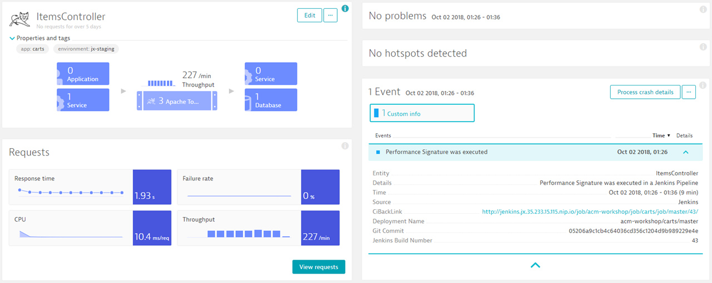

# Define Performance Pipeline

In this lab you will build a Jenkins pipeline for implementing the *Performance as a Self-Service* approach for the carts service. The purpose of this pipeline is that a developer can manually trigger it to run a performance test against a service (in the dev environment) and to retrieve an immediate performance test results. This gives fast feedback if recent changes negatively impacted the service and whether this new version would pass the performance test in the CI pipeline.

## Step 1: Record Dynatrace Session and Push Info Events
1. Switch to the `carts/` directory and open file `carts/Jenkinsfile.performance`. (`Jenkinsfile.complete.performance` is for comparison and debugging.)
1. In this file you find the empty pipeline stage **Performance Check Stage**.
1. Add the following snippet into the **steps { }** section:
    ```
    checkout scm

    recordDynatraceSession(
      envId: 'Dynatrace Tenant',
      testCase: 'loadtest',
      tagMatchRules: [
        [
          meTypes: [
            [meType: 'SERVICE']
          ],
          tags: [
            [context: 'CONTEXTLESS', key: 'app', value: "${env.APP_NAME}"],
            [context: 'CONTEXTLESS', key: 'environment', value: 'dev']
          ]
        ]
      ]
    ) 
    {
    // trigger JMeter test
    }  
    ```
Consequently, the pipeline pushes a *Custom Info Event* for *Performance Signature Validation* including exact timeframe shown in the screenshot below. Besides, the execution of the load test is recorded based on the *recordDynatraceSession* function. 


## Step 2: Trigger JMeter Test by a separate Function
1. Replace the comment **// trigger JMeter test** with the following snippet:
    ```
    container('jmeter') {
      script {
        def status = executeJMeter ( 
          scriptName: "jmeter/${env.APP_NAME}_perfcheck.jmx",
          resultsDir: "PerfCheck_${env.APP_NAME}",
          serverUrl: "${env.APP_NAME}.dev", 
          serverPort: 80,
          checkPath: '/health',
          vuCount: 10,
          loopCount: 250,
          LTN: "PerfCheck_${BUILD_NUMBER}",
          funcValidation: false,
          avgRtValidation: 2000
        )
        if (status != 0) {
          currentBuild.result = 'FAILED'
          error "Performance check failed."
        }
      }
    }
    ```
Consequently, this part of the pipeline executes a jMeter script (as defined by the sriptName) in the context of a jmeter container. The script receives a list of parameters for its configuration. The condition after the *executeJMeter* function terminates the pipeline in case of a failed test.  

## Step 3: Validate the Performance Signature Definition
1. Add the following snippet after the **recordDynatraceSession** and the **container('jmeter') {** segments:
    ```
    perfSigDynatraceReports(
      envId: 'Dynatrace Tenant', 
      nonFunctionalFailure: 1, 
      specFile: "monspec/${env.APP_NAME}_perfsig.json"
    ) 
    ```
Consequently, this part of the pipeline validates the load test result against the performance signature of the carts service.

## Step 4: Create a Performance Pipeline for Carts
1. Go to  **Jenkins** and click on the **sockshop** folder.
1. Click on **New Item** and specify name: `carts.performance`.
1. Select **Multibranch Pipeline** and click on **OK**.
1. At *Branch Sources* select **Git** and set the link to your Github Project Repository *carts*.
1. At *Build Configuration* change *Script Path* from `Jenkins` to `Jenkinsfile.performance`.
1. Finally, click **Save**. This step automatically triggers the pipeline.

## Result: Performance as a Self-Service Pipeline for Carts
```
@Library('dynatrace@master') _

pipeline {
  agent {
    label 'git'
  }
  environment {
    APP_NAME = "carts"
  }
  stages {
    stage('Performance Check') {
      steps {
        checkout scm

        recordDynatraceSession(
          envId: 'Dynatrace Tenant',
          testCase: 'loadtest',
          tagMatchRules: [
            [
              meTypes: [
                [meType: 'SERVICE']
              ],
              tags: [
                [context: 'CONTEXTLESS', key: 'app', value: "${env.APP_NAME}"],
                [context: 'CONTEXTLESS', key: 'environment', value: 'dev']
              ]
            ]
          ]
        ) 
        {
          container('jmeter') {
            script {
              def status = executeJMeter ( 
                scriptName: "jmeter/${env.APP_NAME}_perfcheck.jmx",
                resultsDir: "PerfCheck_${env.APP_NAME}",
                serverUrl: "${env.APP_NAME}.dev", 
                serverPort: 80,
                checkPath: '/health',
                vuCount: 10,
                loopCount: 250,
                LTN: "PerfCheck_${BUILD_NUMBER}",
                funcValidation: false,
                avgRtValidation: 4000
              )
              if (status != 0) {
                currentBuild.result = 'FAILED'
                error "Performance check failed."
              }
            }
          }
        }

        perfSigDynatraceReports(
          envId: 'Dynatrace Tenant', 
          nonFunctionalFailure: 1, 
          specFile: "monspec/${env.APP_NAME}_perfsig.json"
        ) 
      }
    }
  }
}
```

---

[Previous Step: Define Performance Signature](../03_Define_Performance_Signature) :arrow_backward: :arrow_forward: [Next Step: Run Performance Tests](../05_Run_Performance_Tests)

:arrow_up_small: [Back to overview](../)