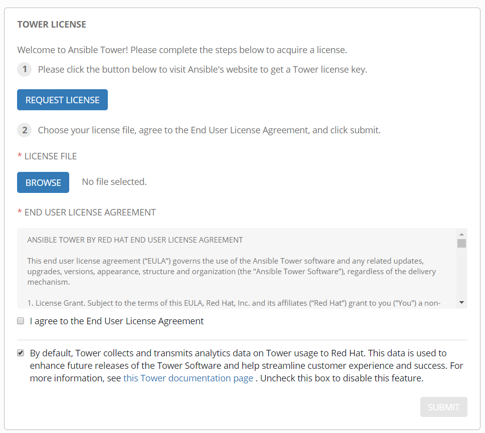
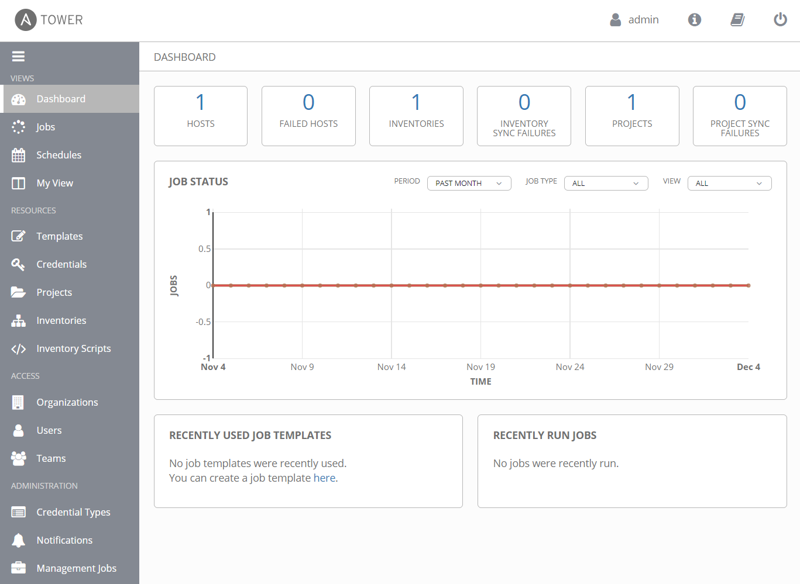

# Install Ansible Tower


1. Cluster Role Binding for `ServiceAccount`
    ```
    $ kubectl create clusterrolebinding kubesystem-cluster-admin-binding --clusterrole=cluster-admin --serviceaccount=kube-system:default
    ```

1. Create Role Binding for User Account.
     - exchange YOURNAME with, e.g., your firstname or your alias
     - exchange username@accont.com with your user of the cluster
    
    <span style="color:red">**TODO**</span>: check if also working with service account!
    ```
    $ kubectl create clusterrolebinding YOURNAME-cluster-admin-binding --clusterrole=cluster-admin --user=username@account.com
    ```

1. Get your current context (needed for `Inventory` in next step). Copy the output from the following command to the clipboard.
    ```
    $ kubectl config current-context
    ```

## Create persistent volume claim

1. Create the namespace for Ansible Tower. Therefore, copy this snippet in a file called `tower-ns.yml` or take the file from this repository.
    ```
    apiVersion: v1
    kind: Namespace
    metadata:
      name: tower
    ```

1. Create persitent volume claim. Thefore, copy this snippet in a file called `postgres-nfs-pvc.yml` or take the file from this repository.
    ```
    apiVersion: v1
    kind: PersistentVolumeClaim
    metadata:
      name: postgresql
    spec:
      accessModes:
        - ReadWriteOnce
      resources:
        requests:
          storage: 10Gi
    ```

1. Create the namespace for Ansible Tower and a persistent volume claim by creating the resources via kubectl. 
    ``` 
    $ kubectl create -f tower-ns.yml
    $ kubectl create -f postgres-nfs-pvc.yml -n tower
    ```

## Download Ansible Tower

1. Download the installer for Ansible Tower on Kubernetes (and OpenShift) and extract it.

    ```
    $ wget https://releases.ansible.com/ansible-tower/setup_openshift/ansible-tower-openshift-setup-3.3.1.tar.gz
    ```
    Extract it.
    ```
    $ tar -xzvf ansible-tower-openshift-setup-3.3.1.tar.gz
    $ cd ansible-tower-openshift-setup-3.3.1/
    ```


## Setup Tower

### Inventory

Place your custom values in the inventory.

1. `nano inventory`
1. Edit the contents, e.g.,:

    ```
    # This will create or update a default admin (superuser) account in Tower
    admin_user='admin'
    admin_password='myPassword'

    # Tower Secret key
    # It's *very* important that this stay the same between upgrades or you will lose
    # the ability to decrypt your credentials
    secret_key='myPassword'

    # Database Settings
    # =================

    # Set pg_hostname if you have an external postgres server, otherwise
    # a new postgres service will be created
    # pg_hostname=postgresql

    # If using an external database, provide your existing credentials.
    # If you choose to use the provided containerized Postgres depolyment, these
    # values will be used when provisioning the database.
    pg_username='admin'
    pg_password='myPassword'
    pg_database='tower'
    pg_port=5432

    rabbitmq_password='myPassword'
    rabbitmq_erlang_cookie='myPassword'

    # Note: The user running this installer will need cluster-admin privileges.
    # Tower's job execution container requires running in privileged mode,
    # and a service account must be created for auto peer-discovery to work.

    # Deploy into Openshift
    # =====================

    # skip this section

    # Deploy into Vanilla Kubernetes
    # ==============================

    kubernetes_context=my_kubernetes_context
    kubernetes_namespace=tower

    ```

1. Save with <kbd>Ctrl</kbd>+<kbd>O</kbd> and exit with <kbd>Ctrl</kbd>+<kbd>X</kbd> 

### Run Install Script

1. `./setup_openshift.sh` (no typo, it has to be openshift)

## Verify Ansible Tower Installation

### Verify running pods

```
$ kubectl get pods -n tower

Output:
NAME                                        READY   STATUS    RESTARTS   AGE
ansible-tower-0                             4/4     Running   0          1h
ansible-tower-postgresql-56b5778f9b-lqbpx   1/1     Running   0          2h
```

### Get services and public IP of Ansible Tower 

**Verify Services**

```
$ kubectl get svc -n tower

Output:
NAME                       TYPE        CLUSTER-IP      EXTERNAL-IP   PORT(S)                          AGE
ansible-tower-postgresql   ClusterIP   10.31.251.32    <none>        5432/TCP                         3h
ansible-tower-rmq-mgmt     ClusterIP   10.31.242.237   <none>        15672/TCP                        3h
ansible-tower-web-svc      NodePort    10.31.248.22    <none>        80:32509/TCP                     3h
rabbitmq                   NodePort    10.31.241.111   <none>        15672:31040/TCP,5672:31838/TCP   3h
```

**Get public IP** 

```
$ kubectl get ingress -n tower

Output:

NAME                    HOSTS   ADDRESS        PORTS   AGE
ansible-tower-web-svc   *       35.190.14.20   80      3h
```

## Login

Open your favourite browser and navigate to the `ADDRESS` of the `ansible-tower-web-svc`. Login with the credentials provided in the `inventory` file above.

### Provide license

Submit the Ansible Tower license when prompted.



In case you don't have your license yet, you can get a free license here: https://www.ansible.com/license 


## Default dashboard.



