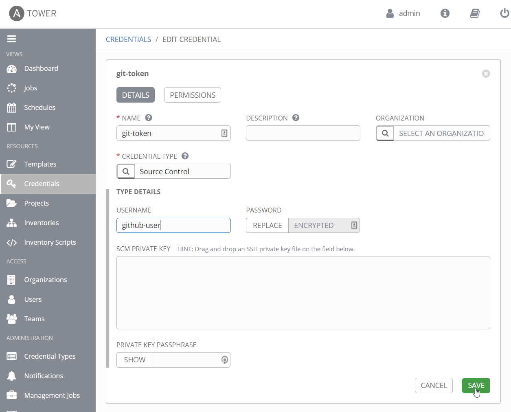

# Setup Ansible Tower

In this lab, we will setup and configure our Ansible Tower environment.
Therefore, we will have to 
- add Github credentials to be able to check out Github repository
- create a project in Ansible Tower that holds defines which repository to use
- create an inventory that holds additional information such as userdata and variables
- create job templates that can then be executed and will run our playbooks.

Let's get started! 

1. Login to the Ansible Tower with the credentials you received from your instructor.

1. Navigate to **Credentials** and add Git credentials to your Ansible Tower organization
    - Name: git-token
    - Organization: orgX (X... your workshop user number)
    - Credential Type: Source Control (click on magnifier and search for the correct type)
    - Type Details: your Github username and your password (password will be encrypted and can not be shown again once stored)

     

1. Navigate to **Project** and create a new project
    - Name: self-healing
    - Organization: orgX (X... your workshop user number)
    - SCM Type: Git
    - SCM Url: `https://github.com/dynatrace-innovationlab/acl-docs-detroit`
    - SCM Credential: git-token
    - SCM Update Options:
      - Check _Clean_: overwrite local changes each time you get latest SCM version

    

1. Navigate to **Inventory** and create a new inventory
    - Name: inventory
    - Organization: orgX (X... your workshop user number)
    - Variables: copy & paste the following snippet
      ```
      ---
      tenantid: "YOUR-TENANT"
      apitoken: "YOUR-API-TOKEN"
      carts_promotion_url: "http://SERVICE-URL/carts/1/items/promotion"
      commentuser: "Ansible Playbook"
      tower_user: "userX"
      tower_password: "dynatrace"
      dtcommentapiurl: "https://{{tenantid}}.live.dynatrace.com/api/v1/problem/details/{{pid}}/comments?Api-Token={{apitoken}}"
      dteventapiurl: "https://{{tenantid}}.live.dynatrace.com/api/v1/events/?Api-Token={{apitoken}}"
      ```

      

1. Navigate to **Templates** and create a new Job Template for the promotional campaign
    - Name: promotion campaign-userX (X... your workshop user number) <br>
      (_job template names have to be unique across the whole Ansible Tower installation_)
    - Job Type: Run
    - Inventory: inventory
    - Project: self-healing
    - Playbook: `10_Runbook_Automation_and_Self_Healing\playbooks\campaign.yaml`
    - Extra Variables: check box _Prompt on Launch_ 
      ```
      ---
      promotion_rate: '0'
      remediation_action: 'https://XX.XXX.XX.XXX/api/v2/job_templates/XX/launch/'
      ```
      Make sure to adjust the values for the **IP address** (XX.XXX.XX.XXX) as well as the **job template ID** (XX) - take a look at the current URL in your browser and copy the IP address.

    


1. Navigate to **Templates** and create a new Job Template for the remediation playbook
    - Name: remediation-userX (X... your workshop user number) <br>
      (_job template names have to be unique across the whole Ansible Tower installation_)
    - Job Type: Run
    - Inventory: inventory
    - Project: self-healing
    - Playbook: `10_Runbook_Automation_and_Self_Healing\playbooks\remediation.yaml`
    - Extra Variables: check box _Prompt on Launch_ 

    

