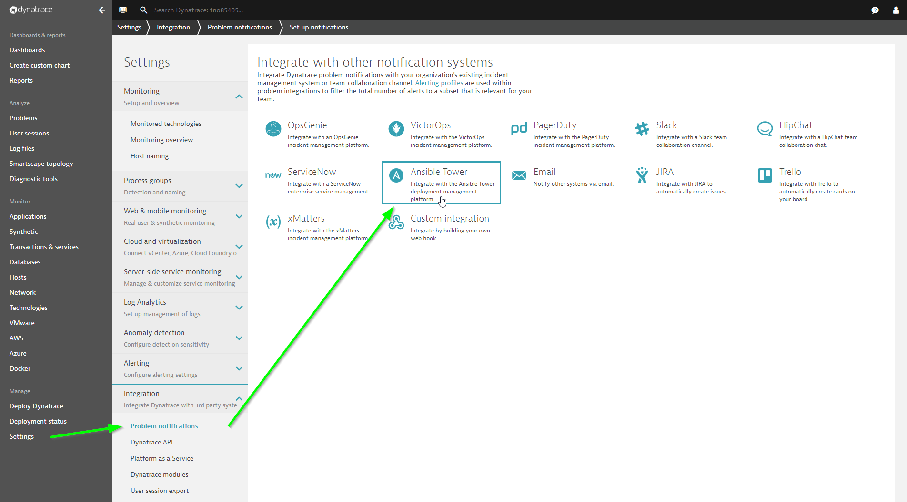
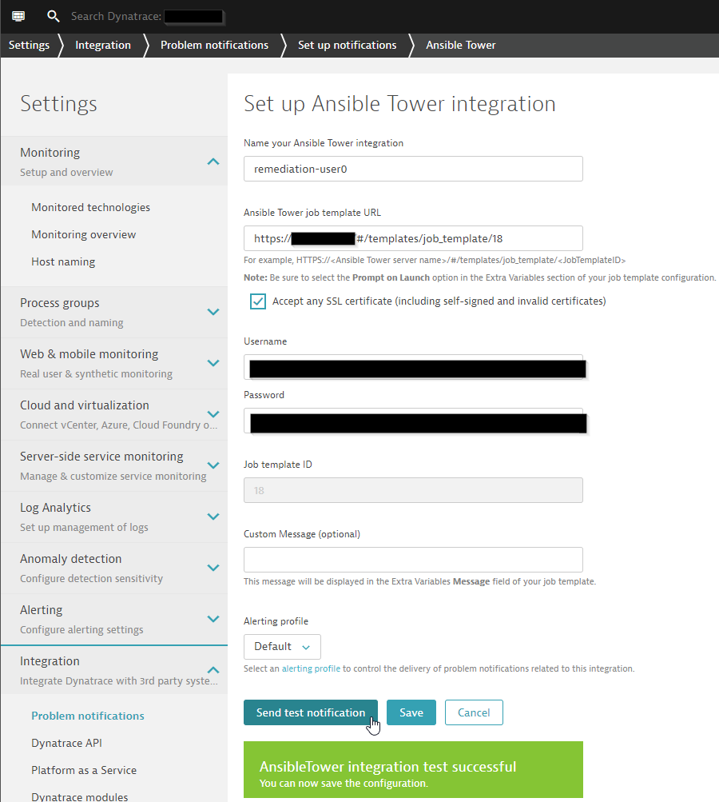
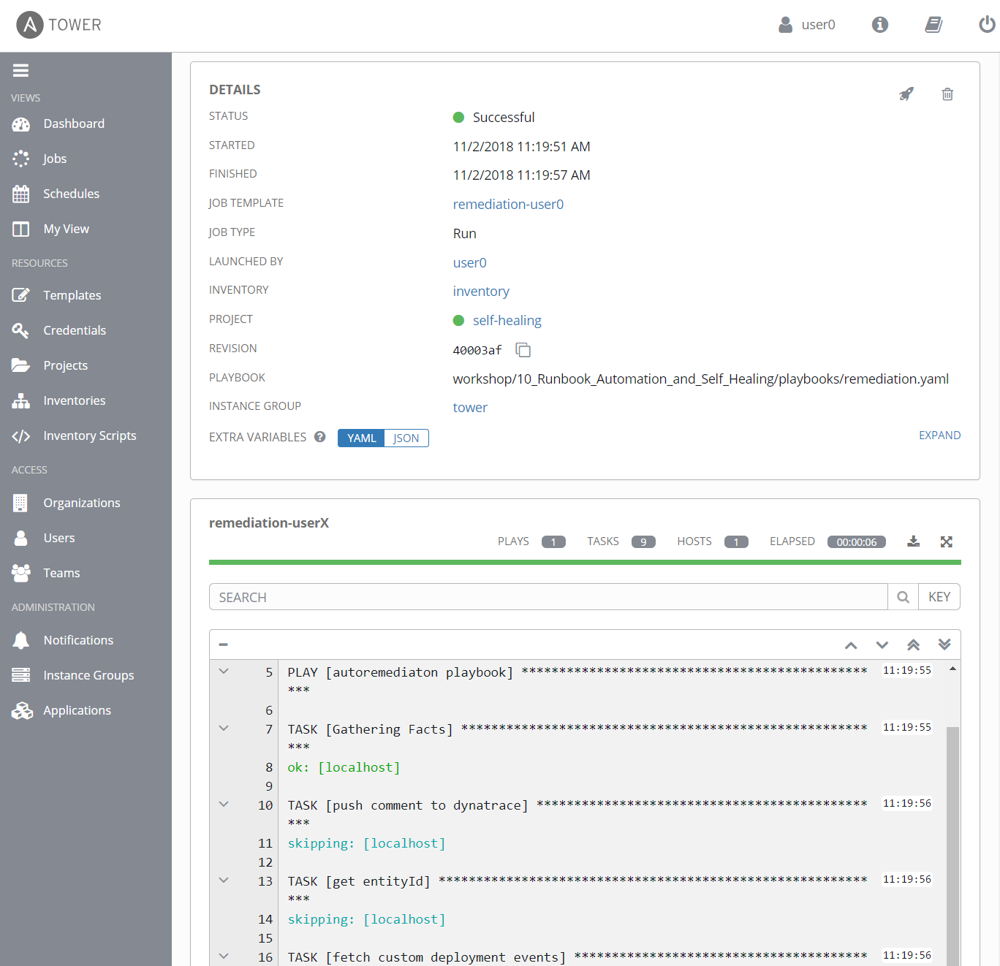

# Integration Ansible Tower Runbook in Dynatrace

Let us integration the defined _remediation runbook_ in Dynatrace in a way, that it will be called each time Dynatrace detects a problem. Please note that in a more enterprise scenario, you might want to define _Alerting profiles_ to be able to control in a more fine-grained way when to call a remediation runbook.

1. Setup a **Problem Notification** in Dynatrace
    - Navigate to _Settings -> Problem notification -> Ansible Tower_ 

    

1. Enter your Ansible Tower job template URL and Ansible Tower credentials.
    - Name: e.g., "remediation playbook"
    - Ansible Tower job template URL: copy & paste the Ansible Tower job URL from your Ansible Tower remediation job template, e.g., `https://XX.XXX.XX.XXX/#/templates/job_template/18`
    - Username: your Ansible Tower username, e.g., `user0`
    - Password: your Ansible Tower password
    - Click "Send test notification" --> a green banner should appear
    - Save the integration

    

1. Login (or navigate back) to you Ansible Tower instance and check what happenend when setting up the integration.
    - Navigate to _Jobs_ and click on your _remediation-userX_ job
    - You can see all tasks from the playbook that have been triggered by the integration.

    

