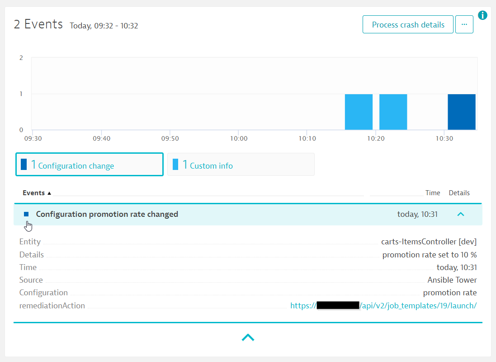
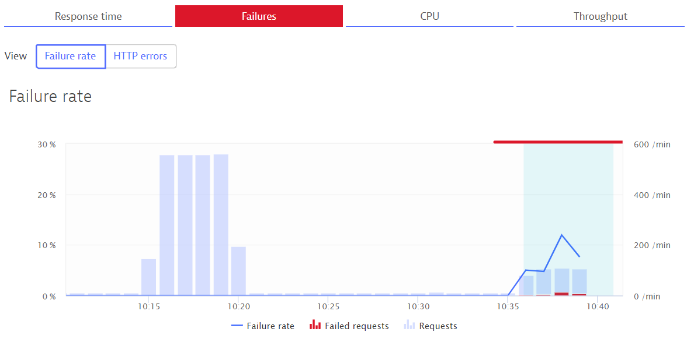
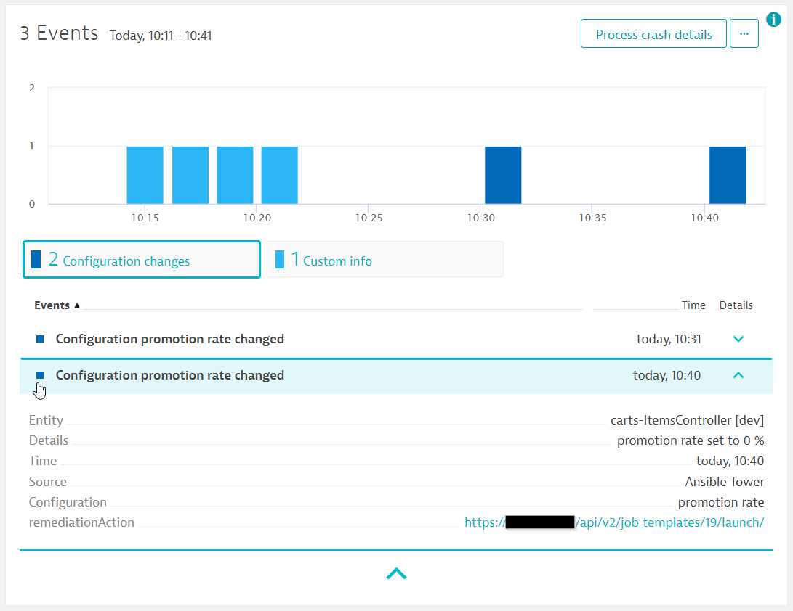
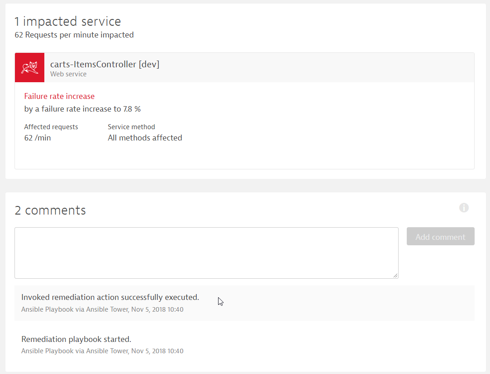

# Run our promotional campaign

In this lab we want to run our promotional campaign in our production environment by applying a change to our configuration of the `carts` service. This service is prepared to allow to add a promotional gift (e.g., Halloween Socks, Christmas Socks, Easter Socks, ...) to a given percentage of user interactions in the `carts` service. 
Therefore, the endpoint `carts/1/items/promotional/` can take as an input a number between 0 and 100 which corresponds to the percentages of user interactions that will receive the promotional gift. E.g., `carts/1/items/promotional/5` will enable it for 5 %, while `carts/1/items/promotional/100` will enable it for 100 % of user interactions. 


## Setup campaign runbook in Ansible Tower

The campaign playbook has already been set up in [Lab 2](../2_Setup_Tower). 

## Run the campaign in our PRODUCTION environment

1. Run the promotional campain
    - Navigate to _Templates_ in your Ansible Tower
    - Click on the "rocket" icon (🚀) next to your _promotion campaign userX_ job template
    
    - Adjust the values accordingly for you promotional campaign:
      - Set the value for `promotion_rate: '10'` to allow for 10 % of the user interactions to receive the promotional gift
      - Do not change the `remedation_action` 
    - Click _Next_
    - Click _Launch_

1. Generate load for the `carts` service
    - Navigate to the `10_Runbook_Automation_and_Self_Healing` folder
    - Start the [load generator](../scripts/) (adjust the IP for the cart service, receive the IP via <br> `kubectl get svc -n prod` ): 
      ```
      $ cd 10_Runbook_Automation_and_Self_Healing\scripts
      $ ./add-to-cart.sh http://XX.XXX.XXX.XX/carts/1/items
      ```

1. Verify the update in the `carts` service in Dynatrace: navigate to the `carts` service in your Dynatrace tenant and verify the configuration change that has been applied and sent to Dynatrace.
    

1. Experience an increase of the failure rate: you will experience an increase of the failure rate of the `carts-ItemController` in Dynatrace once you enable the promotional campaign. 
    

1. Dynatrace will open a problem ticket for the increase of the failure rate. Since we have setup the problem notification with Ansible Tower, the according `remediation` playbook will be executed once Dynatrace sends out the notification.

1. Verify executed playbooks in Ansible Tower:
    Navigate to "Jobs" and verify that Ansible Tower has executed two jobs. The first job - `remediation-userX` was called since Dynatrace sent out the problem notification to Ansible Tower. This job was then executing the remediation tasks which include the execution of the remediation action that is defined in the custom configuration event of the impacted entities (the `carts` service). Therefore, you will also see the `promotion campaign userX` that was executed.

    

1. Verify the change in the configuration in Dynatrace: to fully verify that the remedation was executed, you will find evidence in Dynatrace.
    - New configuration event that set the promotion rate back to 0 %:
    

    - Comment on the Dynatrace problem ticket that the playbook has been executed:
    
    
1. Finished! :)

1. (optional) Use Dynatrace to find the corresponding Java class as well as the exact line number that was responsible for the increase of the failure rate to be able to fix the issue and prevent it to happen again for future campaigns.


    
