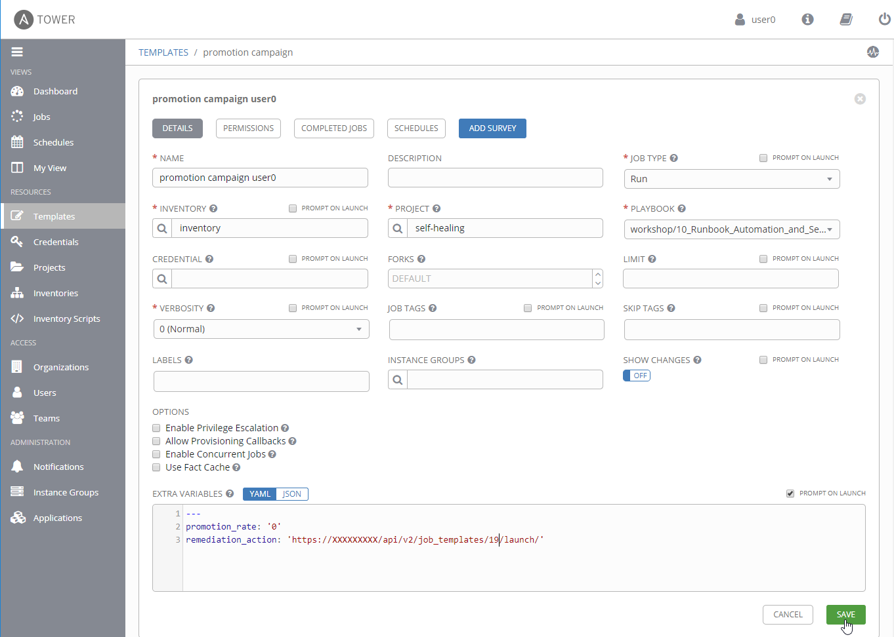

# Setup and run our promotional campaign

In this lab we want to run our promotional campaign in our production environment by applying a change to our configuration of the `carts` service. This service is prepared to allow to add a promotional gift (e.g., Halloween Socks, Christmas Socks, Easter Socks, ...) to a given percentage of user interactions in the `carts` service. 
Therefore, the endpoint `carts/1/items/promotional/` can take as an input a number between 0 and 100 which corresponds to the percentages of user interactions that will receive the promotional gift. E.g., `carts/1/items/promotional/5` will enable it for 5 %, while `carts/1/items/promotional/100` will enable it for 100 % of user interactions. 


## Setup campaign runbook in Ansible Tower

In order to be able to have fine-grained decision when to start and stop the campaign as well as who is allowed to start the campaign, we will use Ansible playbooks.

1. Create **Job Template** for our playbooks
    - Name: promotion campaign-userX (X... your workshop user number) <br>
      (_job template names have to be unique across the whole Ansible Tower installation_)
    - Job Type: Run
    - Inventory: inventory
    - Project: self-healing
    - Playbook: `10_Runbook_Automation_and_Self_Healing\playbooks\campaign.yaml`
    - Extra Variables: check box _Prompt on Launch_ 
      ```
      ---
      promotion_rate: '0'
      remediation_action: 'https://XX.XXX.XX.XXX/api/v2/job_templates/XX/launch/'
      ```
      Make sure to adjust the values for the **IP address** (XX.XXX.XX.XXX) as well as the **job template ID** (XX)

    

1. Run the promotional campain
    - Navigate to _Templates_ in your Ansible Tower
    - Click on the "rocket" icon (🚀) next to your _promotion campaign userX_ job template
    
    - Adjust the values accordingly for you promotional campaign:
      - Set the value for `promotion_rate: '10'` to allow for 10 % of the user interactions to receive the promotional gift
      - Do not change the `remedation_action` 
    - Click _Next_
    - Click _Launch_

1. Generate load for the `carts` service
    - Navigate to the `10_Runbook_Automation_and_Self_Healing` folder
    - Start the load generator: 
      ```
      ./add-to-cart.sh http://XX.XXX.XXX.XX/carts/1/items
      ```

1. Watch the service in Dynatrace

1. Investigate steps of auto-remediation in Dynatrace

1. Verify executed playbooks in Ansible Tower


    
