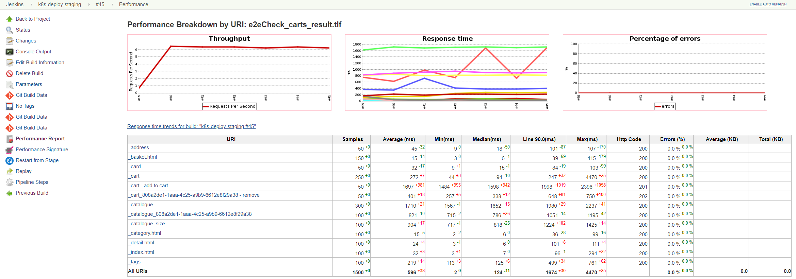

# Simulate Early Pipeline Break

In this lab you'll release a service to staging that is not tested based on performance tests. Intentionally, the service is slowed down to fail at the e2e check in the staging pipeline.

## Step 1: Introduce a Slowdown in the Carts Service
1. Make sure you are in the master branch.
    ```
    (local)$ git checkout master
    ```
1. In the directory of `carts\`, open the file: `carts\src\main\resources\application.properties`.
1. Change the value of `delayInMillis` from `0` to `1000` and save.
1. Open the file `carts\src` and increase the version from `0.6.0` to `0.6.5`
1. Commit/Push the changes to your GitHub Repository *carts*.

## Step 2: Create a new Release
1. Switch to the `carts/` directory.
1. Run the following commands to create a new branch.
    ```
    (local)$ git checkout -b release/0.6.5
    (local)$ git push -u origin release/0.6.5 
    (local)$ git checkout master
    ```

## Step 3. Build the new Release in Jenkins
1. Go to **Jenkins** and **sockshop**.
1. Click on **carts** pipeline and **Scan Multibranch Pipeline Now**.
1. Hit **F5** and you should see the new branch, which gets built and deployed to staging. 
1. (trigger build manually) Click on *release/0.6.5* and click on **Build Now**.

## Step 4: Follow the Jenkins Build Pipelines
1. Open the current build by clicking on the **#no**.
1. In the Console Output wait for *Starting building: k8s-deploy-staging* and click on that link.
1. The pipeline should fail due to a too high response time. 
1. Click on **Performance Report** to see the average response time of the URI: *_cart - add to cart*



## Step 5: Remove the Slowdown in the Carts Service
1. Make sure you are in the master branch.
    ```
    (local)$ git checkout master
    ```
1. In the directory of `carts\`, open the file: `carts\src\main\resources\application.properties`.
1. Change the value of `delayInMillis` from `1000` to `0` and save.
1. Open the file `carts\src` and increase the version from `0.6.5` to `0.6.6`
1. Commit/Push the changes to your GitHub Repository *carts*.

## Step 6: Create a new Release
1. Switch to the `carts/` directory.
1. Run the following commands to create a new branch.
    ```
    (local)$ git checkout -b release/0.6.6
    (local)$ git push -u origin release/0.6.6 
    (local)$ git checkout master
    ```

## Step 7. Build the new Release in Jenkins
1. Go to **Jenkins** and **sockshop**.
1. Click on **carts** pipeline and **Scan Multibranch Pipeline Now**.
1. Hit **F5** and you should see the new branch, which gets built and deployed to staging. 
1. (trigger build manually) Click on *release/0.6.5* and click on **Build Now**.


---
[Previous Step: Harden Staging Pipeline with Quality Gate](../01_Harden_Staging_Pipeline_with_Quality_Gate) :arrow_backward: :arrow_forward: [Next Step: Setup Self Healing for Production](../03_Setup_Self_Healing_for_Production)

:arrow_up_small: [Back to overview](../)
